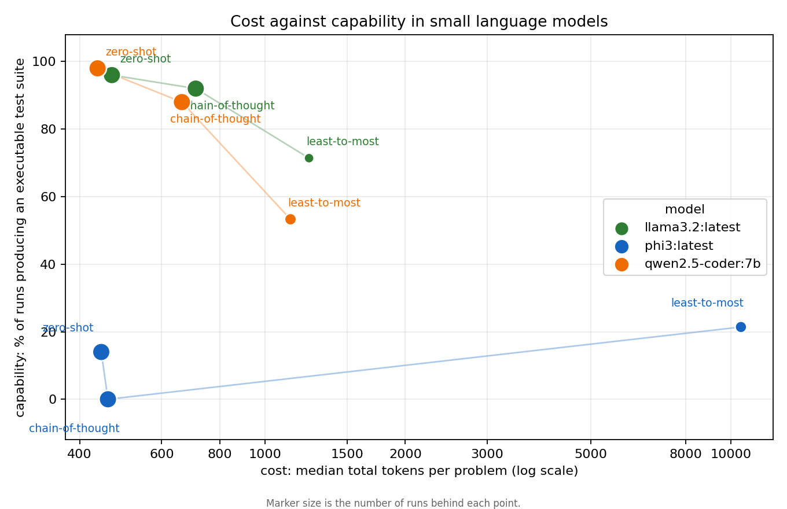

# Cost and capability in small language models

**What does a cheaper prompt buy, and what does it lose?**

A small study of how a language model's output degrades when you constrain
what you spend on it. Three prompting strategies are measured on both sides at
once: what each costs the model in tokens, and what capability each retains.
Test generation is the task used to make capability measurable.

## Why I built this

For two years I built AI tooling into a production CI/CD pipeline for a four
developer team. One of the things I wrote was a context budgeter that packs a
bounded, relevant slice of a repository into every prompt. With open-source
context optimisation it cut our token consumption by 60 to 80 percent, measured
as tokens sent per task.

I never measured what it did to the quality of the output. We adopted it
because it was cheaper and nothing obviously broke.

This repository is me answering the other half of that question on a scale I
can actually run, after reading Kumari and Deb's work on the sustainability of
prompt strategies for SLM-based test generation, which measures exactly the
tradeoff I had been ignoring.

## The question

**How much capability does a small language model lose when you prompt it more
cheaply?**

Cost and capability are usually reported separately: a benchmark score in one
paper, a cost figure in another. Here they are measured on the same run, so the
tradeoff is visible rather than inferred.

Capability is operationalised as the branch coverage achieved by the tests the
model writes, plus whether its output is valid Python at all and whether the
tests it produces actually pass. Test generation is used because it makes model
output objectively gradable: code either runs or it does not, and coverage is a
number rather than a judgement.

## Method

- **Problems.** 25 tasks from HumanEval, filtered to those whose canonical
  solution has at least two branches. Branch coverage on straight-line code
  carries no signal, so the easy problems are excluded on purpose.
- **Strategies.** Three of the seven Kumari and Deb compare, chosen to span
  their cost range:
  - `zero_shot` — one call, no reasoning scaffold
  - `chain_of_thought` — one call, reasoning requested before the code
  - `least_to_most` — two calls: decompose the behaviours to test, then write
    tests against that list
- **Models.** Three small models served locally through Ollama:
  qwen2.5-coder 7B, llama3.2 3B and phi3 3.8B.
- **Repeats.** Two samples per cell with a varying seed at fixed temperature.
- **Measured per run.** *Cost:* prompt tokens, completion tokens (as reported
  by the model itself, not re-tokenised), wall-clock time and model evaluation
  time. *Capability:* whether the output is valid Python, whether it executes,
  how many of its tests pass, and the **branch coverage** it achieves over the
  reference implementation.

## Reproduce it

```bash
pip install -r requirements.txt
ollama pull qwen2.5-coder:7b
ollama pull llama3.2
ollama pull phi3

python src/run.py --models qwen2.5-coder:7b llama3.2:latest phi3:latest --repeats 2
python src/analyze.py
```

Results stream to `results/raw/` and completed cells are skipped, so the run
can be interrupted and resumed. `src/run.py --backend mock` exercises the
pipeline without a model.

**Generated code is executed.** See [NOTES.md](NOTES.md).

## Results

| model | strategy | n | median tokens | median sec | branch % | executable % | pass rate % |
|---|---|---|---|---|---|---|---|
| qwen2.5-coder:7b | zero_shot | 50 | **437** | 7.0 | 98.1 | **98.0** | **86.7** |
| qwen2.5-coder:7b | chain_of_thought | 50 | 663 | 13.5 | 96.2 | 88.0 | 79.6 |
| qwen2.5-coder:7b | least_to_most | 15 | 1134 | 21.0 | 100.0 | 53.3 | 64.8 |
| llama3.2 | zero_shot | 50 | **469** | 4.1 | 97.8 | **96.0** | **68.0** |
| llama3.2 | chain_of_thought | 50 | 710 | 7.1 | 98.5 | 92.0 | 58.2 |
| llama3.2 | least_to_most | 7 | 1243 | 12.7 | 90.0 | 71.4 | 43.3 |
| phi3 | zero_shot | 50 | 445 | 4.1 | 85.7 | 14.0 | 47.1 |
| phi3 | chain_of_thought | 50 | 460 | 4.1 | n/a | 0.0 | n/a |
| phi3 | least_to_most | 14 | 10511 | 278.0 | 33.3 | 21.4 | 78.3 |

`least_to_most` is incomplete on every model. It was abandoned after runs began
timing out on qwen2.5-coder and consuming 10,000 to 27,000 tokens on phi3. The
partial rows are kept because the cost is itself the finding, but they rest on
7 to 15 runs rather than 50.

Branch coverage is conditional on the suite executing at all, so it should be
read alongside the executable column rather than on its own. The 100 percent
coverage on qwen's `least_to_most` is measured over the half of its runs that
ran. Cells are marked `n/a` where nothing executed, because the figure is
undefined there rather than zero.

See [NOTES.md](NOTES.md) on why phi3 is reported as an anomaly rather than a
result.



## What I found

On both models where the harness behaved, the cheaper prompt was also the
better one. Zero-shot used about a third fewer tokens than chain-of-thought
(437 against 663 on qwen2.5-coder, 469 against 710 on llama3.2) and still
produced more executable test suites (98 against 88 percent, and 96 against 92
percent) with higher pass rates (86.7 against 79.6 percent, and 68.0 against
58.2 percent). I did not find a tradeoff to measure. Asking the model to reason
before writing cost more and returned less.

Where this differs from the reference study is narrower than it first looks.
That study reports reasoning-heavy strategies buying better coverage at higher
cost. On branch coverage my two strategies are within about two points of each
other on both models, and on llama3.2 chain-of-thought is marginally ahead, so
nothing here contradicts that claim. The difference is in the proportion of
runs that produced an executable suite at all, and the pass rate of the tests
that did, neither of which the reference study reports. Chain-of-thought did
not buy worse coverage here. It more often produced nothing to measure coverage
on. Mine is also a much smaller study, uses my own prompt wording rather than
theirs, and measures tokens rather than energy, so the difference may well be
mine rather than theirs.

The larger effect was the model, not the prompt. qwen2.5-coder produced an
executable suite 98 percent of the time and llama3.2 96 percent, while phi3
managed 14 percent under the same harness. Whatever prompting buys here,
choosing the model bought more.

The two-call strategy cost between two and twenty-four times the tokens of
zero-shot, and on the runs that finished it produced fewer usable suites than
either single-call strategy. It is not ranked against them here: the arm was
abandoned partway and rests on 7 to 15 runs per model rather than 50, which is
not enough to place it.

## Limitations

Read [NOTES.md](NOTES.md) before drawing anything from these numbers. The short
version: phi3's results are probably an artifact of how this harness calls the
model rather than a property of the model, the least-to-most arm is incomplete,
there is no energy or carbon measurement, coverage is a proxy for test quality
and not the same thing, one benchmark and one language, and tests are generated
against a solution already known to be correct.

## Reference

P. Kumari and N. Deb, *Sustainability Analysis of Prompt Strategies for
SLM-based Automated Test Generation*, arXiv:2604.02761.

P. Kumari and N. Deb, *An Empirical Study of Sustainability in Prompt-driven
Test Script Generation Using Small Language Models*, arXiv:2604.02754.

This study borrows their question and a subset of their strategies. It is not
affiliated with their group and any errors here are mine.